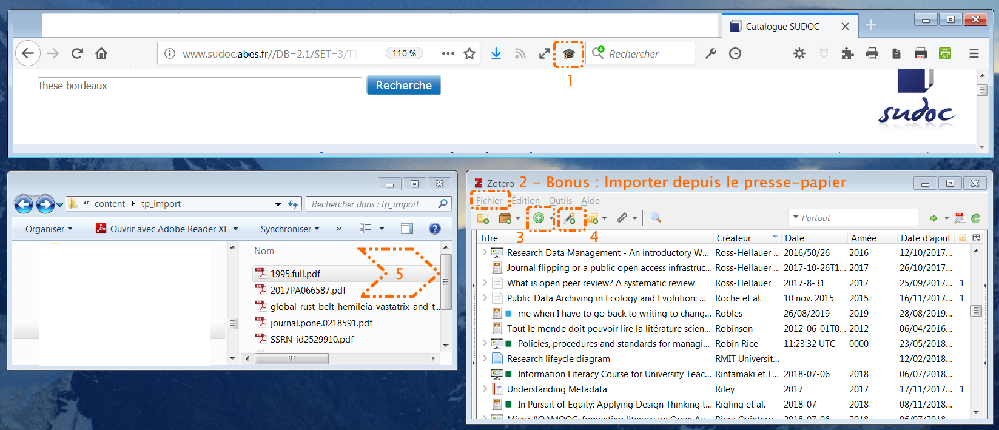
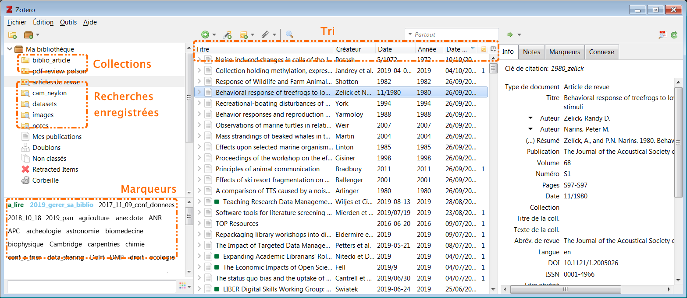
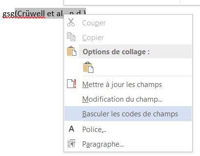

<!-- $theme: default-->
<!-- $size: 16:9 -->

 

2019-11-XX
 

Frédérique Flamerie
*science ouverte/données de recherche*
*Université de Bordeaux - Direction de la documentation*

:email: frederique.flamerie-de-lachapelle@u-bordeaux.fr
:telephone_receiver: 05.40.00.89.91

 

---
# Pourquoi Zotero?

## :zap: Utiliser Zotero pourrait vous exposer à éviter certains problèmes.
_La liste suivante n'est pas exhaustive._
* Acquérir/renouveler une licence logicielle adaptée à votre matériel et votre système d'exploitation, puis financer les mises à jour de version.
* Trouver un outil qui vous permette de collaborer facilement avec vos étudiants et vos collègues.
* Gérer la dispersion et l'absence de liens entre les références biblio, les fichiers des articles (et d'autres fichiers), les notes, etc.

 

:information_source: [Billet du blog Zotero francophone : Pourquoi Zotero?](https://zotero.hypotheses.org/1998)
 :information_source: [Tableau comparatif de plusieurs logiciels de gestion bibliographique par les bibliothécaires de l'EPFL](https://fbib.gitbooks.io/up-to-speed-with-zotero/content/02-comparing-refman/)
 
---

# Programme
1. Installer Zotero 
2. Importer des documents dans votre bibliothèque depuis PubMed, depuis la bibliothèque Zotero du labo, etc. 
3. Toutes les méthodes d'import
4. Gérer vos PDF avec Zotero
5. Organiser votre bibliothèque Zotero
6. Citer avec les modules Zotero pour Word et LibreOffice
7. Sauvegarder vos données Zotero
8. Service après formation :question: Zotero / suivi des modifications Word

:point_right: Une version très allégée et condensée de la formation de l'Urfist de Bordeaux :  [Gérer facilement sa bibliographie avec Zotero](https://github.com/fflamerie/zotero_gerer_biblio)
:point_right: Pour tout ce qui concerne la synchronisation : formation de l'Urfist de Bordeaux : [Partager sa biblio avec Zotero](https://github.com/fflamerie/zotero_collaborative)

---
# 1. Installer Zotero
A partir de la page <https://www.zotero.org/download> :two: composants doivent être installés :
1. le **logiciel** Zotero, application indépendante du navigateur,
2.  le **connecteur** adapté à votre navigateur, **Chrome, Firefox ou ~~Safari~~** - voir :  [Zotero connectors differences?](https://forums.zotero.org/discussion/comment/289139) sur le forum Zotero.

:information_source: [Documentation Zotero : Installation](https://www.zotero.org/support/fr/installation)

---

# 2. Importer des documents dans votre bibliothèque depuis PubMed, depuis la bibliothèque Zotero du labo, etc. 

C'est la méthode la plus fiable, la plus simple et la plus recommandée. 
URL de la bibliothèque Zotero du labo : https://www.zotero.org/groups/XXXXX

---

# 3. Toutes les méthodes d'import

1/ [Via votre navigateur web](https://www.zotero.org/support/fr/adding_items_to_zotero#via_votre_navigateur_web) - 2/ [Importer depuis d'autres outils](https://www.zotero.org/support/fr/adding_items_to_zotero#importer_depuis_d_autres_outils) 
3/ [Ajouter manuellement des documents](https://www.zotero.org/support/fr/adding_items_to_zotero#ajouter_manuellement_des_documents) - 4/ [Ajouter un document par son identifiant](https://www.zotero.org/support/fr/adding_items_to_zotero#ajouter_un_document_par_son_identifiant)  5/[Ajouter des PDF et d'autres fichiers](https://www.zotero.org/support/fr/adding_items_to_zotero#ajouter_des_pdf_et_d_autres_fichiers) - 6/ [Imports massifs depuis des bases de données](https://www.zotero.org/support/fr/adding_items_to_zotero#imports_massifs_depuis_des_bases_de_donnees) 

---

# 4. Gérer vos PDF avec Zotero
## 4.1 Ajouter un PDF ou un autre fichier à un document
Sélectionner un document dans la bibliothèque Zotero, puis menu 

**:paperclip: > Ajouter une pièce jointe > Joindre une copie enregistrée d'un fichier** 

accessible depuis  la barre d'outils Zotero ou par un clic-droit 

:information_source: [Documentation Zotero : Ajouter des fichiers à votre bibliothèque Zotero](https://www.zotero.org/support/fr/attaching_files)

## 4.2 Plus d'options avec le module complémentaire ZotFile

:information_source: [Billet du blog Zotero francophone : ZotFile : un outil pour gérer vos PDF](https://zotero.hypotheses.org/2838)

---

# 5. Organiser votre bibliothèque Zotero

  

:information_source: Documentation Zotero : [Collections and Tags](https://www.zotero.org/support/collections_and_tags),  [Rechercher](https://www.zotero.org/support/fr/searching), [Tri](https://www.zotero.org/support/fr/sorting), [Notes](https://www.zotero.org/support/fr/notes) et [Related](https://www.zotero.org/support/related)
:information_source: Documentation Zotero : [Détection des doublons](https://www.zotero.org/support/fr/duplicate_detection) et [Vérifier et modifier les documents de votre bibliothèque](https://www.zotero.org/support/fr/adding_items_to_zotero#editer_des_documents)
:information_source: Billets du blog Zotero francophone : [Comment organiser sa bibliothèque?](https://zotero.hypotheses.org/756) et [Nettoyer les références collectées, quelques astuces](https://zotero.hypotheses.org/760)

---

# 5. Organiser votre bibliothèque Zotero

:information_source: Pour en savoir plus sur la fonctionnalité _Retracted Items_ : [Billet du blog Zotero francophone : Notifications pour les articles rétractés grâce à l’intégration de Retraction Watch](https://zotero.hypotheses.org/2809)

---

# 6. Citer avec les modules Zotero pour Word et LibreOffice

		

:information_source: Documentation Zotero : [Les styles bibliographiques](https://www.zotero.org/support/fr/styles) et [Préférences > Citer](https://www.zotero.org/support/fr/preferences/cite)  
:information_source: Documentation Zotero : [Créer des bibliographies](https://www.zotero.org/support/fr/creating_bibliographies) et [Modules de traitement de texte](https://www.zotero.org/support/fr/word_processor_integration)

---

# 7. Sauvegarder vos données Zotero

:warning: 2 points de vigilance 
* Assurez-vous que le répertoire de données Zotero fait bien partie des données que vous sauvegardez automatiquement et régulièrement.
* Si vous avez un profil itinérant Windows, déplacez votre répertoire de données Zotero à un autre emplacement.

Gérer votre répertoire de données Zotero :
**Préférences > Avancées > Fichiers et dossiers > Emplacement du répertoire de données**

:information_source:  [Documentation Zotero : Le répertoire de données Zotero](https://www.zotero.org/support/fr/zotero_data)

---

# 8. Zotero / suivi des modifications Word : option 1

Les difficultés de l'utilisation conjointe du mode de suivi des modifications de Word et de Zotero ont fait l'objet de plusieurs discussions sur le forum Zotero : [discussion 1](https://forums.zotero.org/discussion/24219/word-plugin-in-track-change-mode-field-code-changed/p2), [discussion 2](https://forums.zotero.org/discussion/65455/safer-track-changes-practices-in-word), [discussion 3](https://forums.zotero.org/discussion/35140/word-accept-changes-converts-to-field-code). 

La page [Why do I see code beginning with ADDIN ZOTERO_ITEM CSL_CITATION in my document instead of formatted citations?](https://www.zotero.org/support/kb/word_field_codes) de la documentation regroupe toutes les instructions.

Dans les versions récentes de Word, en mode de suivi des modifications, Word affiche en effet tout le contenu des codes de champ pour chaque citation Zotero qui a été modifiée, _i. e._ tout le code et les informations bibliographiques stockés derrière le texte mis en forme d'un appel de citation du type `(Smith, 2019)`.

Une première option est de désactiver le mode de suivi des modifications lorsque l'on travaille sur les citations Zotero.

:point_down:

---

# 8. Zotero / suivi des modifications Word : option 2

Sinon, si une demande d'acceptation de modification apparaît pour une citation, il faut  **cliquer 2 fois sur le bouton "Accepter"** du mode de suivi des modifications de Word.  

Si le contenu des codes de champ persiste à apparaître, 2 options :
  * cliquer sur **Alt+9** ou Option+Fn+F9 pour une bascule globale dans tout le document,
  * pour chaque citation, utiliser le menu contextuel (clic-droit) "Basculer les codes de champs"

---

# Merci pour votre attention

N'hésitez pas à me contacter pour toute question, de la migration d'une bibliothèque EndNote à la création d'un style bibliographique personnalisé.

 

 

:email: frederique.flamerie-de-lachapelle@u-bordeaux.fr
:telephone_receiver: 05.40.00.89.91

---

# Crédits

  

**Auteur**
Frédérique Flamerie

 

**Visuels**
Site [Zotero](https://www.zotero.org/)
